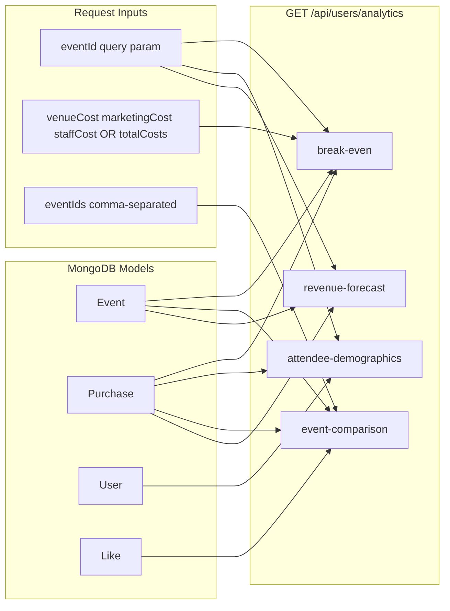

# Analytics APIs Implementation Plan

## Current codebase reality (factual)

| Spec assumption | What exists today |
|-----------------|-------------------|
| `events` / `event_costs` tables | [`models/Event.js`](models/Event.js) only — no cost fields |
| `tickets` / `ticket_purchases` | [`models/Purchase.js`](models/Purchase.js) linked via `event` + `user` |
| `registrations` / `user_profiles` | No separate tables; buyers are `Purchase.user` → [`models/user.js`](models/user.js) |
| Age / gender demographics | **Not stored** on User |
| Refunds | **Not tracked** (only `refund_policy` text on Event) |
| Page views / leads | **Not tracked** (nearest proxy: `Event.likes` → Like documents) |
| Check-in / attendance | `Purchase.tickets_type_sale.scanned` + `scannedAtLog` |

Existing patterns to follow:
- Auth: [`middleware/auth.js`](middleware/auth.js) (`req.user._id`, `req.user.type`)
- Owner scoping: same as [`routes/users.js`](routes/users.js) `owner-dashboard` (filter events by `user: userId`)
- Revenue fields: `Purchase.totalPrice` (buyer net), `Purchase.ownerPrice` (organizer earnings), `Event.total_tickets_sale`
- Route registration: [`startup/routes.js`](startup/routes.js) — mount new router at `/api/users/analytics`



---

## File structure (new, isolated from production flows)

| File | Purpose |
|------|---------|
| [`controllers/analyticsController.js`](controllers/analyticsController.js) | Four handler functions + shared helpers |
| [`routes/analyticsRoutes.js`](routes/analyticsRoutes.js) | Route definitions with `auth` middleware |
| [`startup/routes.js`](startup/routes.js) | One line: `app.use("/api/users/analytics", analyticsRoutes)` |

No schema changes in this phase (per your decisions).

### Shared helpers (inside analytics controller)

- `assertEventAccess(eventId, userId, userType)` — load Event; 404 if missing; 403 if `user.type !== 'admin'` and `event.user !== userId`
- `getEventPurchases(eventId, select)` — `Purchase.find({ event, resel_by: { $exists: false } })`
- `sumTicketsSold(purchases)` — `purchases.reduce((s, p) => s + Number(p.tickets || 0), 0)`
- `sumGrossRevenue(purchases)` — sum `totalPrice` (consistent with [`routes/users.js`](routes/users.js) dashboard graph)
- `sumScannedTickets(purchases)` — sum `tickets_type_sale.scanned.length`
- `toDistribution(counts)` — convert `{ "London": 3, "Manchester": 2 }` → `{ "London": 0.6, "Manchester": 0.4 }`

---

## 1. `GET /api/users/analytics/break-even`

**Auth:** `auth` (owner or admin)

**Query params:**
- `eventId` (required)
- Costs (no DB storage): either `totalCosts` **or** `venueCost` + `marketingCost` + `staffCost` (all numbers)

**Calculations (from existing data + query costs):**

```text
totalCosts     = totalCosts OR venueCost + marketingCost + staffCost
totalRevenue   = SUM(Purchase.totalPrice) for event
ticketsSold    = SUM(Purchase.tickets) OR Event.total_tickets_sale
avgTicketPrice = ticketsSold > 0 ? totalRevenue / ticketsSold : weighted avg from Event.ticket_plans[].price (fallback)
breakEvenTickets = avgTicketPrice > 0 ? totalCosts / avgTicketPrice : null
progressPct    = breakEvenTickets > 0 ? (ticketsSold / breakEvenTickets) * 100 : 0
```

**Sales velocity & projection:**
- `daysElapsed` = max(1, days since first `Purchase.createdAt` for event, or `Event.createdAt` if no sales)
- `velocity` = ticketsSold / daysElapsed (tickets per day)
- `daysUntilEvent` = max(0, days until `Event.start_Date`)
- `projectedTicketsAtEvent` = ticketsSold + velocity * daysUntilEvent
- `projectedRevenue` = projectedTicketsAtEvent * avgTicketPrice
- `projectedProfitLoss` = projectedRevenue - totalCosts

**Response shape:**

```json
{
  "success": true,
  "eventId": "...",
  "totalCosts": 5000,
  "totalRevenue": 1200,
  "ticketsSold": 48,
  "averageTicketPrice": 25,
  "breakEvenTickets": 200,
  "progressPercentage": 24,
  "salesVelocity": { "ticketsPerDay": 2.4, "daysElapsed": 20 },
  "projection": {
    "daysUntilEvent": 30,
    "projectedTickets": 120,
    "projectedRevenue": 3000,
    "projectedProfitLoss": -2000
  }
}
```

**Validation:** 400 if `eventId` or costs missing/invalid; 404/403 via `assertEventAccess`.

---

## 2. `GET /api/users/analytics/attendee-demographics`

**Auth:** `auth`

**Query:** `eventId` (required)

**Flow:** Aggregate unique buyers (`Purchase.user`) for the event, join `User`, group by available location fields:
- Primary: `User.address` (string)
- Fallback: `User.location.address`
- City/state: parse from address if possible; otherwise group by raw address string

**Hybrid response (available now + documented gaps):**

```json
{
  "success": true,
  "eventId": "...",
  "totalAttendees": 42,
  "age_distribution": null,
  "gender_distribution": null,
  "city_distribution": { "London": 0.57, "Unknown": 0.43 },
  "state_distribution": { "England": 0.71, "Unknown": 0.29 },
  "_meta": {
    "available_dimensions": ["city", "state"],
    "pending_dimensions": ["age", "gender"],
    "note": "Age/gender require User profile fields — planned follow-up schema extension"
  }
}
```

**Implementation:** MongoDB aggregation (`$lookup` users, `$group` by location field). Percentages = count / totalAttendees.

---

## 3. `GET /api/users/analytics/event-comparison`

**Auth:** `auth`

**Query:** `eventIds` (required, comma-separated, max ~10)

**Per event metrics (all from existing models):**

| Metric | Source |
|--------|--------|
| `totalTicketsSold` | `Event.total_tickets_sale` |
| `grossRevenue` | SUM `Purchase.totalPrice` |
| `attendanceRate` | `scannedTickets / ticketsSold` (0 if no sales) |
| `totalRefunds` | `0` + `_meta.pending: true` |
| `conversionRate` | `purchasesCount / likesCount` (Like docs on event) — **proxy only** |

**Response:**

```json
{
  "success": true,
  "events": [
    {
      "eventId": "...",
      "name": "Summer Fest",
      "totalTicketsSold": 120,
      "grossRevenue": 3000,
      "attendanceRate": 0.85,
      "totalRefunds": 0,
      "conversionRate": 0.12,
      "leadsProxy": { "likes": 1000, "purchases": 120 }
    }
  ],
  "_meta": {
    "refunds": "Not tracked in current schema; returns 0",
    "conversionRate": "Proxy: purchases / event likes until page-view tracking exists"
  }
}
```

**Access:** Each event must pass `assertEventAccess` before inclusion; skip unauthorized IDs or return 403 if none accessible (recommend 403 if any requested event is not owned).

---

## 4. `GET /api/users/analytics/revenue-forecast`

**Auth:** `auth`

**Query:** `eventId` (required)

**Flow:**
1. Load target event + purchases
2. **Current velocity:** tickets sold in last 7 days / 7 (fallback to all-time velocity if < 7 days of data)
3. **Historical baseline:** past events by same `Event.user` + same `category`, with `start_Date < now`, that have at least 1 purchase; compute each event's peak-period velocity; take median
4. **Projection:** `daysUntilEvent` from `Event.start_Date`; `projectedTickets = ticketsSold + currentVelocity * daysUntilEvent`
5. **Revenue range:** `projectedRevenue = projectedTickets * avgTicketPrice`; bounds = ±20% (or scale by velocity variance across historical events)
6. **Confidence score (0–100):** `100 - abs(currentVelocity - historicalVelocity) / max(historicalVelocity, 1) * 100`, clamped; lower if < 3 historical events

**Response:**

```json
{
  "success": true,
  "eventId": "...",
  "currentVelocity": { "ticketsPerDay": 3.2, "windowDays": 7 },
  "historicalVelocity": { "ticketsPerDay": 2.8, "sampleSize": 5 },
  "forecast": {
    "projectedTickets": 150,
    "revenueLowerBound": 2700,
    "revenueUpperBound": 4050,
    "expectedRevenue": 3375
  },
  "confidenceScore": 78,
  "_meta": {
    "method": "Linear projection from 7-day velocity vs historical median",
    "historicalMatchCriteria": ["same owner", "same category"]
  }
}
```

---

## Auth & access rules

- All routes: `[auth]` middleware
- **Owner:** may only query events where `Event.user === req.user._id`
- **Admin:** may query any event (consistent with [`middleware/admin.js`](middleware/admin.js) dashboard access pattern)
- Return `{ success: false, message: "..." }` with 400/403/404 — match existing [`routes/users.js`](routes/users.js) style

---

## Follow-up phase (documented, not in this implementation)

| Gap | Planned schema addition |
|-----|-------------------------|
| Age / gender demographics | Add `dateOfBirth`, `gender` to User |
| Refunds | Add `refundedAt`, `refundAmount` on Purchase or Refund model |
| Conversion rate | Add `EventView` / analytics event tracking |
| Persistent event costs | Optional `EventCost` model (you chose query params for now) |

---

## Testing checklist

- Break-even with `totalCosts` and with split costs; zero sales (fallback avg from `ticket_plans`)
- Demographics with buyers having `address` / `location.address` / empty
- Event comparison with 2+ owned events; 403 for another owner's eventId
- Revenue forecast for new event (low confidence, small sample)
- Admin token can access any event; owner token cannot access others' events
