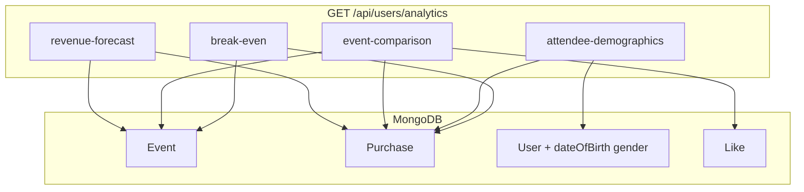

# Analytics APIs Implementation Plan

## Codebase facts (verified)

| Spec concept | Actual model / field |
|--------------|----------------------|
| Events | [`models/Event.js`](models/Event.js) — `ticket_plans`, `total_tickets_sale`, `city`/`state`, `likes`, `start_Date` |
| Ticket purchases | [`models/Purchase.js`](models/Purchase.js) — `event`, `user`, `tickets`, `totalPrice`, `ownerPrice`, `tickets_type_sale.scanned` |
| Users / profiles | [`models/user.js`](models/user.js) — `address`, `location.address` only today (no age/gender yet) |
| Event costs table | **Does not exist** |
| Refunds | **Not tracked** (`refund_policy` is text only on Event) |
| Page views / leads | **Not tracked** (proxy: `Event.likes` → [`models/like.js`](models/like.js)) |
| Check-in | `Purchase.tickets_type_sale.scanned.length` |

Existing patterns to reuse:
- Auth: [`middleware/auth.js`](middleware/auth.js) — `req.user._id`, `req.user.type`
- Owner scoping: same as [`routes/users.js`](routes/users.js) `owner-dashboard` (`Event.user === userId`)
- Revenue: `Purchase.totalPrice` (buyer net), `Purchase.ownerPrice` (organizer earnings)
- Route mount: [`startup/routes.js`](startup/routes.js) — add `app.use("/api/users/analytics", analyticsRoutes)`



---

## Files to create / modify

| File | Change |
|------|--------|
| [`models/user.js`](models/user.js) | Add optional `dateOfBirth: Date`, `gender: String` (enum: `male`, `female`, `other`, `prefer_not_to_say`) — no breaking change |
| [`controllers/analyticsController.js`](controllers/analyticsController.js) | **New** — shared helpers + 4 handlers |
| [`routes/analyticsRoutes.js`](routes/analyticsRoutes.js) | **New** — 4 GET routes with `auth` |
| [`startup/routes.js`](startup/routes.js) | Register router: `app.use("/api/users/analytics", analyticsRoutes)` |

No changes to existing production purchase/event flows.

---

## Shared helpers (`analyticsController.js`)

- `assertEventAccess(eventId, userId, userType)` — load Event; 404 if missing; 403 if not admin and `event.user !== userId`
- `getEventPurchases(eventId)` — `Purchase.find({ event, resel_by: { $exists: false } })`
- `sumTicketsSold(purchases)` — `SUM(p.tickets)`
- `sumRevenue(purchases)` — `SUM(p.totalPrice)` (gross buyer net, consistent with admin dashboard graph in [`routes/users.js`](routes/users.js))
- `sumScannedTickets(purchases)` — `SUM(p.tickets_type_sale.scanned.length)`
- `avgTicketPrice(purchases, event)` — revenue / ticketsSold; fallback to weighted avg from `event.ticket_plans[].price`
- `toDistribution(counts)` — `{ key: count/total }` for chart-ready percentages
- `ageBracket(dateOfBirth)` — `"18-24"`, `"25-34"`, `"35-44"`, `"45-54"`, `"55+"`, `"Unknown"`

---

## 1. `GET /api/users/analytics/break-even`

**Query:** `eventId` (required) + costs via **`totalCosts`** OR **`venueCost` + `marketingCost` + `staffCost`**

**Logic:**
```text
totalCosts       = totalCosts OR venueCost + marketingCost + staffCost
totalRevenue     = SUM(Purchase.totalPrice)
ticketsSold      = SUM(Purchase.tickets)
avgTicketPrice   = ticketsSold > 0 ? totalRevenue / ticketsSold : ticket_plans fallback
breakEvenTickets = avgTicketPrice > 0 ? totalCosts / avgTicketPrice : null
progressPct      = breakEvenTickets > 0 ? (ticketsSold / breakEvenTickets) * 100 : 0
velocity         = ticketsSold / max(1, days since first purchase or Event.createdAt)
projectedTickets = ticketsSold + velocity * daysUntil(Event.start_Date)
projectedPL      = projectedTickets * avgTicketPrice - totalCosts
```

**Response:**
```json
{
  "success": true,
  "eventId": "...",
  "totalCosts": 5000,
  "totalRevenue": 1200,
  "ticketsSold": 48,
  "averageTicketPrice": 25,
  "breakEvenTickets": 200,
  "progressPercentage": 24,
  "salesVelocity": { "ticketsPerDay": 2.4, "daysElapsed": 20 },
  "projection": {
    "daysUntilEvent": 30,
    "projectedTickets": 120,
    "projectedRevenue": 3000,
    "projectedProfitLoss": -2000
  },
  "_meta": { "costsSource": "query_params" }
}
```

---

## 2. `GET /api/users/analytics/attendee-demographics`

**Query:** `eventId` (required)

**Flow:** MongoDB aggregation on purchases for event → `$lookup` users → group unique buyers by:
- **Age:** from new `User.dateOfBirth` via `ageBracket()`; missing → `"Unknown"`
- **Gender:** from new `User.gender`; missing → `"Unknown"`
- **City/State:** `User.address` or `User.location.address` (parse comma-separated segments; fallback `"Unknown"`)

**Response:**
```json
{
  "success": true,
  "eventId": "...",
  "totalAttendees": 42,
  "age_distribution": { "25-34": 0.42, "Unknown": 0.58 },
  "gender_distribution": { "female": 0.55, "Unknown": 0.45 },
  "city_distribution": { "London": 0.57, "Unknown": 0.43 },
  "state_distribution": { "England": 0.71, "Unknown": 0.29 }
}
```

**Note:** Existing users without `dateOfBirth`/`gender` will appear under `"Unknown"` until profiles are backfilled.

---

## 3. `GET /api/users/analytics/event-comparison`

**Query:** `eventIds` (required, comma-separated, max 10)

**Per-event metrics:**

| Field | Source |
|-------|--------|
| `totalTicketsSold` | `Event.total_tickets_sale` |
| `grossRevenue` | `SUM(Purchase.totalPrice)` |
| `attendanceRate` | `scannedTickets / ticketsSold` |
| `totalRefunds` | `0` (proxy until Refund model exists) |
| `conversionRate` | `purchaseCount / likesCount` (likes = leads proxy) |

**Access:** Each `eventId` must pass `assertEventAccess`; return 403 if any requested event is not owned (unless admin).

**Response:**
```json
{
  "success": true,
  "events": [
    {
      "eventId": "...",
      "name": "Summer Fest",
      "totalTicketsSold": 120,
      "grossRevenue": 3000,
      "attendanceRate": 0.85,
      "totalRefunds": 0,
      "conversionRate": 0.12,
      "leadsProxy": { "likes": 1000, "purchases": 120 }
    }
  ],
  "_meta": {
    "refunds": "Not tracked; returns 0",
    "conversionRate": "Proxy: unique purchases / event likes"
  }
}
```

---

## 4. `GET /api/users/analytics/revenue-forecast`

**Path:** `/api/users/analytics/revenue-forecast` (per your decision — not `/api/v1`)

**Query:** `eventId` (required)

**Logic:**
1. **Current velocity:** tickets sold in last 7 days / 7 (fallback: all-time velocity if event is newer)
2. **Historical baseline:** past events by same `Event.user` + same `category`, `start_Date < now`, with ≥1 purchase; median tickets/day during their sales window
3. **Projection:** `projectedTickets = ticketsSold + currentVelocity * daysUntil(start_Date)`
4. **Revenue range:** `expected = projectedTickets * avgTicketPrice`; bounds ±20% (widen if historical sample < 3)
5. **Confidence (0–100):** based on `|currentVelocity - historicalVelocity| / max(historicalVelocity, 1)`, penalized for small sample size

**Response:**
```json
{
  "success": true,
  "eventId": "...",
  "currentVelocity": { "ticketsPerDay": 3.2, "windowDays": 7 },
  "historicalVelocity": { "ticketsPerDay": 2.8, "sampleSize": 5 },
  "forecast": {
    "projectedTickets": 150,
    "expectedRevenue": 3375,
    "revenueLowerBound": 2700,
    "revenueUpperBound": 4050
  },
  "confidenceScore": 78,
  "_meta": {
    "method": "7-day velocity vs historical median (same owner + category)"
  }
}
```

---

## Auth and errors

- All routes: `[auth]` middleware
- **Owner:** only events where `Event.user === req.user._id`
- **Admin:** any event (`req.user.type === 'admin'`)
- Errors: `{ success: false, message: "..." }` with 400 / 403 / 404 — match [`routes/users.js`](routes/users.js) style

---

## Deferred (documented in `_meta`, not in this PR)

| Gap | Future work |
|-----|-------------|
| Persistent event costs | `EventCost` model or cost fields on Event |
| Refunds | `refundedAt` / `refundAmount` on Purchase or Refund collection |
| Real conversion | `EventView` / analytics event tracking |

---

## Testing checklist

- Break-even: split costs vs `totalCosts`; zero sales (ticket_plans fallback for avg price)
- Demographics: buyers with/without new `dateOfBirth` and `gender`
- Event comparison: 2 owned events; 403 on another owner's `eventId`
- Revenue forecast: new event (low confidence, small historical sample)
- Admin vs owner access tokens
