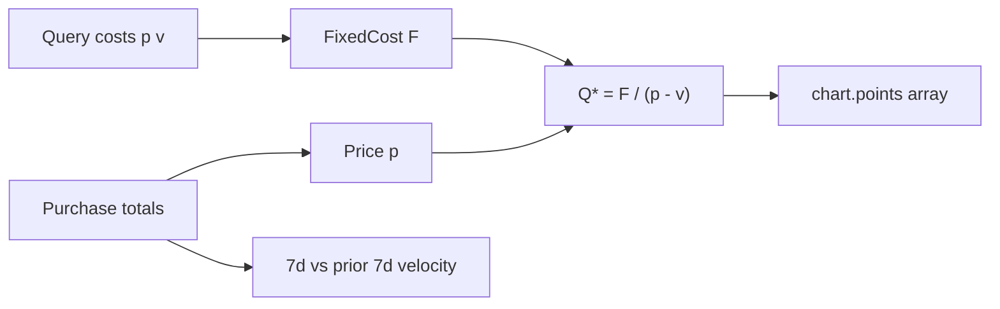

# Analytics API UI Payload Enhancement Plan

## Scope

**Single file to modify:** [`controllers/analyticsController.js`](controllers/analyticsController.js)

No schema changes. All new cost inputs remain **query params** (consistent with existing break-even design). Existing response fields are preserved; new fields are additive.

---

## Data sources (verified)

| UI field | Source |
|----------|--------|
| Ticket type | `Purchase.tickets_type_sale.type` (`general`, `vip`, `vvip`, `earlybird`) |
| Tickets / revenue | `Purchase.tickets`, `Purchase.totalPrice` |
| Event date | `Event.start_Date` |
| Weekly trends | `Purchase.createdAt` bucketed into 7 intervals |
| Historical final sales | `SUM(tickets)` on past owner+category events at `start_Date < now` |
| Benchmarks | Aggregate over owner's active events in same `category` |
| YoY pairing | Normalize `Event.name` (strip 4-digit years), pair similar names, compare newer vs older `start_Date` |

---

## 1. Break-Even (`GET /api/users/analytics/break-even`)

### New query params

Extend `parseCosts()`:

- `equipmentCost` — added to fixed costs sum
- `variableCostPerUnit` (alias `v`) — per-ticket variable cost

Fixed cost sum becomes:

```text
F = venueCost + marketingCost + staffCost + equipmentCost
   OR totalCosts (if provided, still overrides)
```

### Updated break-even formula (match UI)

```text
p = averageTicketPrice
v = variableCostPerUnit (default 0)
Q* = F / (p - v)   when (p - v) > 0, else null
```

Return 400 if `variableCostPerUnit >= pricePerUnit`.

### New response fields

```json
{
  "costs": {
    "venueCost": 8000,
    "marketingCost": 2000,
    "staffCost": 3000,
    "equipmentCost": 2000,
    "variableCostPerUnit": 0,
    "totalFixedCost": 15000
  },
  "pricePerUnit": 50,
  "ticketsRemaining": 75,
  "salesTrend": "Rising",
  "chart": {
    "fixedCost": 15000,
    "pricePerUnit": 50,
    "variableCostPerUnit": 0,
    "breakEvenQuantity": 300,
    "maxQuantity": 450,
    "points": [
      { "quantity": 0, "revenue": 0, "totalCost": 15000 },
      { "quantity": 300, "revenue": 15000, "totalCost": 15000 }
    ]
  }
}
```

**`ticketsRemaining`:** `Math.max(0, Math.ceil(breakEvenTickets - ticketsSold))`

**`salesTrend`:** compare 7-day velocity vs prior 7-day window on purchases:
- `Rising` if current > prior × 1.05
- `Falling` if current < prior × 0.95
- `Stable` otherwise (or if insufficient history)

**`chart.points`:** generate ~20 steps from `0` to `max(maxQuantity, breakEvenQuantity × 1.5, ticketsSold)` where:
- `revenue = quantity × p`
- `totalCost = F + quantity × v`

Frontend can plot intersecting lines from `chart` variables alone if it prefers client-side rendering.



---

## 2. Attendee Demographics (`GET /api/users/analytics/attendee-demographics`)

### New aggregation

Query all non-resell purchases for `eventId`, group by `tickets_type_sale.type`, sum `tickets` per type.

### Label mapping (UI-friendly)

| DB enum | UI label |
|---------|----------|
| `general` | General Admission |
| `vip` | VIP |
| `vvip` | VVIP |
| `earlybird` | Early Bird |

### New response field

```json
{
  "ticket_type_distribution": {
    "General Admission": 0.75,
    "VIP": 0.15,
    "Early Bird": 0.10
  }
}
```

Use existing `toDistribution()` helper on ticket counts.

### Age bracket alignment (minor)

Merge `45-54` and `55+` into single `45+` bucket to match UI donut labels.

---

## 3. Revenue Forecast (`GET /api/users/analytics/revenue-forecast`)

### New helper: `getHistoricalFinalTicketSales(ownerId, categoryId, excludeEventId)`

For each past event (same owner + category, `start_Date < now`, ≥1 purchase):
- `finalTickets = SUM(Purchase.tickets)`
- Return `median(finalTickets)` and `sampleSize`

### New `currentStatus` block

```json
{
  "currentStatus": {
    "eventDate": "2026-08-15T00:00:00.000Z",
    "remainingDaysUntilEvent": 59,
    "ticketsSold": 500,
    "revenueSoFar": 25000
  },
  "historicalFinalTicketSales": 1100,
  "historicalVelocity": { "ticketsPerDay": 2.8, "sampleSize": 5 }
}
```

Keep existing `forecast`, `confidenceScore`, `currentVelocity` unchanged.

`forecast.projectedTickets` maps to UI **Forecast Final Ticket Sales**; `forecast.expectedRevenue` maps to **Expected Revenue**.

---

## 4. Event Comparison (`GET /api/users/analytics/event-comparison`)

### Per-event: weekly trend series (W1–W7)

New helper `buildWeeklyTrend(purchases, event)`:
- `windowStart` = first purchase `createdAt` or `event.createdAt`
- `windowEnd` = `min(now, event.start_Date)`
- Split `[windowStart, windowEnd]` into **7 equal buckets**
- Each bucket: `{ week: "W1", ticketsSold, revenue }` (cumulative or per-week — use **cumulative tickets** to match rising line charts in UI)

Attach to each event object:

```json
{
  "weeklyTrend": [
    { "week": "W1", "ticketsSold": 120, "revenue": 3600 },
    { "week": "W7", "ticketsSold": 1200, "revenue": 36000 }
  ]
}
```

### Benchmarking block (owner + category scope)

After loading compared events, determine `categoryId` from the first event (or most common category among selected).

Query all owner's active events in that category (excluding deleted), aggregate purchases:

```json
{
  "benchmarking": {
    "scope": "owner_category",
    "categoryId": "...",
    "averageTicketsSold": 1500,
    "averageRevenue": 45000,
    "averageAttendanceRate": 0.885,
    "averageMarketingConversion": 0.043
  }
}
```

Attendance/conversion use same formulas as per-event metrics. Document conversion as likes-proxy in `_meta`.

### YoY variance (name-based pairing)

New helper `normalizeEventName(name)` — lowercase, strip 4-digit years, trim punctuation.

Group selected events by normalized name. For each group with ≥2 events:
- Sort by `start_Date` ascending
- Compare **newest vs previous** (or oldest pair if only 2)
- Emit:

```json
{
  "yoyComparisons": [
    {
      "eventGroup": "Summer Music Festival",
      "baselineEvent": { "eventId": "...", "name": "... 2025", "year": 2025 },
      "comparisonEvent": { "eventId": "...", "name": "... 2026", "year": 2026 },
      "revenueVariance": 18000,
      "ticketsVariance": 600,
      "attendanceRateVariance": 0.07
    }
  ]
}
```

If no name pairs found among selected events, return `yoyComparisons: []` with `_meta.note`.

### Event selector list support

Add optional `includeSelectorList=true` query param returning owner's events in same categories with summary stats for the left-panel checklist (name, tickets, revenue, attendanceRate). **Optional** — only if frontend needs it in same call; otherwise frontend can use existing event list APIs.

*Recommendation:* include lightweight `events` entries already returned; add `selectorSummary` per event (`ticketsSold`, `grossRevenue`, `attendanceRate`) so the checklist can render without a second API.

---

## Shared helpers to add

| Helper | Purpose |
|--------|---------|
| `parseCosts(query)` | Add `equipmentCost`, `variableCostPerUnit` |
| `computeSalesTrend(purchases)` | 7d vs prior 7d → Rising/Falling/Stable |
| `buildChartPoints(F, p, v, maxQty)` | Revenue vs total-cost line data |
| `ticketTypeLabel(type)` | Enum → UI label |
| `buildWeeklyTrend(purchases, event)` | W1–W7 buckets |
| `getHistoricalFinalTicketSales(...)` | Median final ticket count |
| `getOwnerCategoryBenchmarks(ownerId, categoryId)` | Platform averages for owner+category |
| `buildYoYComparisons(events, metricsByEventId)` | Name-based pairing + variance |
| `normalizeEventName(name)` | Strip year for pairing |

---

## Error handling (unchanged pattern)

- 400: missing params, `v >= p`, invalid `eventIds`
- 403/404: `assertEventAccess`
- All new fields omitted or null only when mathematically impossible (e.g. `breakEvenQuantity: null` when `p <= v`)

---

## Testing checklist

- Break-even with `equipmentCost=2000`, `variableCostPerUnit=5`, verify `Q* = 15000 / (50-5) = 333.33`
- Break-even `salesTrend` with purchases in last 7d vs prior 7d
- Demographics `ticket_type_distribution` for mixed vip/general purchases
- Forecast returns `currentStatus` + `historicalFinalTicketSales` integer
- Event comparison returns `weeklyTrend` (7 points), `benchmarking`, `yoyComparisons` for "Festival 2025" + "Festival 2026"
- Owner cannot see another owner's benchmarks; admin uses event owner's category scope
